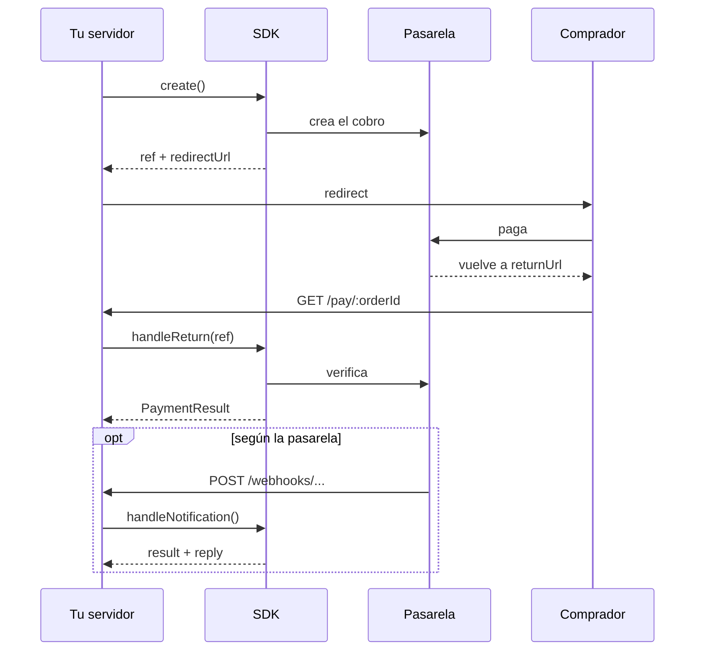

# pago-cl-sdk

[](https://github.com/arquen-lab/pago-cl/actions/workflows/ci.yml)
[](https://www.npmjs.com/package/pago-cl-sdk)
[](LICENSE)

Cobra con Webpay, Flow, Mercado Pago, Khipu, Fintoc y otras pasarelas chilenas usando siempre la misma API. Cada una crea cobros, firma webhooks y reembolsa a su manera, y esa diferencia es la fricción de integrarlas. Aquí está resuelta una sola vez: instalas el paquete, eliges el `provider` y cobras. Si después quieres cambiar de proveedor, solo tocas `provider` y `env`.

El SDK es gratis y de código abierto (MIT); las comisiones de cada pasarela son aparte. También es colaborativo: si falta una pasarela o algo no calza con su documentación, abre un issue o un PR. La guía está en [CONTRIBUTING.md](CONTRIBUTING.md).

| | Pasarela | `provider` | Webhook | Sitio |
|---|---|---|---|---|
|  | [Transbank Webpay Plus](docs/pasarelas/transbank.md) | `transbank` | ninguno | [www.transbank.cl](https://www.transbank.cl) |
|  | [Flow](docs/pasarelas/flow.md) | `flow` | requerido | [www.flow.cl](https://www.flow.cl) |
|  | [Mercado Pago](docs/pasarelas/mercadopago.md) | `mercadopago` | opcional | [www.mercadopago.cl](https://www.mercadopago.cl) |
|  | [Venti](docs/pasarelas/venti.md) | `venti` | opcional | [ventipay.com](https://ventipay.com) |
|  | [Getnet](docs/pasarelas/getnet.md) | `getnet` | opcional | [www.getnet.cl](https://www.getnet.cl) |
|  | [Klap](docs/pasarelas/klap.md) | `klap` | requerido | [www.klap.cl](https://www.klap.cl) |
|  | [Khipu](docs/pasarelas/khipu.md) | `khipu` | opcional | [khipu.com](https://khipu.com) |
|  | [Fintoc](docs/pasarelas/fintoc.md) | `fintoc` | opcional | [fintoc.com](https://fintoc.com) |

> Todavía estamos en `0.x`, así que la API puede cambiar entre versiones menores. Todo cambio queda anotado en el [CHANGELOG](CHANGELOG.md).

## Instalación

```sh
pnpm add pago-cl-sdk   # o npm i / yarn add
```

Necesitas Node 20 o superior. No trae dependencias.

## Uso

```ts
import { createPaymentAdapter, fromWebRequest } from 'pago-cl-sdk';

const payments = createPaymentAdapter({
    provider: 'venti',                 // cualquiera de la tabla de arriba
    env: { apiKey },                   // tipado según el provider
});

// 1. Crear el pago y guardar la ref junto a tu orden
const { ref, redirectUrl } = await payments.create({
    orderId: 'ORD-1042',
    amount: 12990,
    returnUrl: 'https://shop.example/pay/ORD-1042',
});
await saveOrder({ orderId: 'ORD-1042', ref });
redirect(redirectUrl);

// 2. El comprador vuelve a /pay/:orderId
const order = await findOrder(orderId);
const result = await payments.handleReturn(order.ref, await fromWebRequest(request));
await applyResult(result);   // PENDING · AUTHORIZED · PAID · REJECTED · CANCELED · EXPIRED
```

Con otra pasarela cambian `provider` y `env`, y en algunas un campo del cobro. Todo eso está en la página de cada una.



## Transporte propio (`fetch`)

La configuración (`env`) de cada pasarela acepta un `fetch` opcional con la firma estándar `(input: RequestInfo | URL, init?: RequestInit) => Promise<Response>` (tipo `FetchLike`). Si no lo pasas, el SDK usa el `fetch` global, resuelto en cada llamada. Sirve para salir por un proxy, una bóveda de secretos o un doble de pruebas, sin tocar `globalThis.fetch`.

```ts
const payments = createPaymentAdapter({
  provider: 'transbank',
  env: {
    commerceCode,
    apiKey: '{{secret.apiSecret}}', // el SDK no valida ni transforma la llave: la pone tal cual en el encabezado
    fetch: (input, init) => vault.fetch(input, init), // el transporte reemplaza la llave al salir de la red
  },
});
```

El SDK nunca registra el `apiKey` ni lo incluye en errores, en la `PaymentRef` o en `data`. Un fallo del transporte llega como `PaymentError` (`PROVIDER_ERROR`, reintentable).

### Cloudflare Workers

`generateOrderId` y la firma de Flow ya usan estándares web (`crypto.randomUUID()`, `URLSearchParams`). Aún quedan imports de `node:crypto` y `Buffer` en la verificación de webhooks y en Getnet (HMAC/SHA-256 síncronos), por lo que en Workers necesitas el flag `nodejs_compat`. Webpay Plus no los usa en su flujo, pero comparten el mismo bundle. Reemplazarlos por Web Crypto (asíncrono) cambiaría la API y queda para una versión mayor.

## Documentación

- [Uso básico](docs/uso.md): reembolsos, estados, reglas comunes y errores.
- [Webhooks](docs/webhooks.md): cuáles son obligatorios, cuáles opcionales y cómo manejarlos.
- [Pasarelas](docs/pasarelas/README.md): una página por pasarela, con su configuración y todos sus métodos.

## Contribuir

Si quieres ayudar con un bug, la documentación o una pasarela nueva, bienvenido. Parte por [CONTRIBUTING.md](CONTRIBUTING.md) y revisa el [código de conducta](CODE_OF_CONDUCT.md). Si encontraste una vulnerabilidad, escribe por [SECURITY.md](SECURITY.md) y no abras un issue.

## Licencia

[MIT](LICENSE) © Arquen Lab. Es un proyecto independiente, sin relación con las pasarelas. Sus marcas son de sus dueños.
