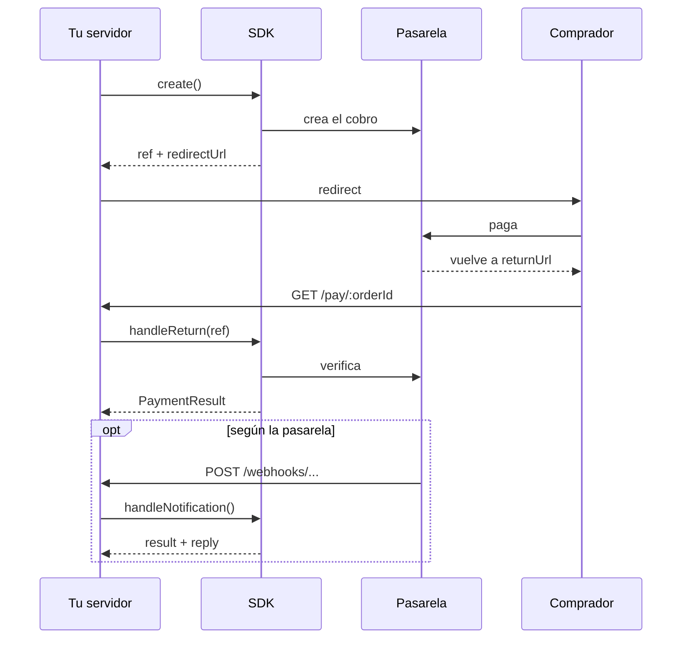

# Uso básico

El flujo es el mismo en todas las pasarelas. Lo que cambia entre ellas está en [su página](pasarelas/README.md).

## El flujo



## Paso a paso

```ts
import { createPaymentAdapter, fromWebRequest } from 'pago-cl-sdk';

const payments = createPaymentAdapter({
    provider: 'venti',                 // cualquiera de la tabla de pasarelas
    env: { apiKey },                   // tipado según el provider
});

// 1. Crear el pago y guardar la ref junto a tu orden
const { ref, redirectUrl } = await payments.create({
    orderId: 'ORD-1042',
    amount: 12990,
    returnUrl: 'https://shop.example/pay/ORD-1042',
});
await saveOrder({ orderId: 'ORD-1042', ref });
redirect(redirectUrl);

// 2. El comprador vuelve a /pay/:orderId
const order = await findOrder(orderId);
const result = await payments.handleReturn(order.ref, await fromWebRequest(request));
await applyResult(result);   // PENDING · AUTHORIZED · PAID · REJECTED · CANCELED · EXPIRED

// 3. Después: consultar, capturar, cancelar, reembolsar
await payments.getStatus(order.ref);
await payments.refund(order.ref, { amount: 5000 });   // sin amount: reembolso total
```

`applyResult` la escribes tú y tiene que ser idempotente. El retorno, el webhook y `getStatus` te entregan el mismo `PaymentResult`, y pueden llegar repetidos o en cualquier orden.

## Reglas comunes

- `orderId`: hasta 26 caracteres, con letras, números, `-` y `_`. Si no lo pasas, se genera uno.
- `amount`: CLP entero, UF hasta 4 decimales, USD hasta 2.
- `returnUrl`: es tu URL, completa, y conviene que lleve tu `orderId` en la ruta. Al volver, el SDK comprueba token, orden y monto, y si algo no calza lanza `RETURN_MISMATCH`.
- `PaymentRef` es opaco y serializable. Guárdalo completo junto a tu orden.
- Un reembolso no es un estado del pago: lo devuelto se acumula en `refundedAmount`. `final` te avisa si el estado ya no va a cambiar solo.
- Si pides algo que la pasarela no soporta, falla con `NOT_SUPPORTED` sin llamar a su API.

## Errores

Todos los errores son `PaymentError` y traen un `code`:

| `code` | Cuándo |
|---|---|
| `INVALID_INPUT` | Un campo no cumple la regla. `field` dice cuál |
| `MISSING_FIELD` | La pasarela exige un campo que falta |
| `NOT_SUPPORTED` | La operación no existe en esa pasarela |
| `RETURN_MISMATCH` | El retorno o el pago consultado no corresponde a la orden |
| `VERIFICATION_FAILED` | La firma del webhook no es válida |
| `CONFIG_ERROR` | Falta un dato en `env` |
| `PROVIDER_ERROR` | La pasarela respondió con error o no respondió. Trae `provider.httpStatus`, `providerCode` y `retryable` |
