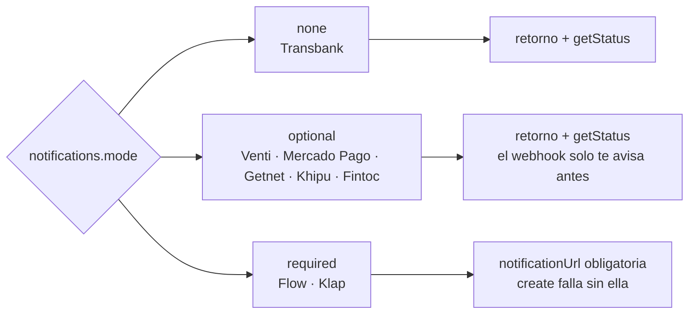

# Webhooks

Volver a la [documentación](README.md).

No todas las pasarelas necesitan un webhook, y el SDK te avisa cuál es el caso en `payments.capabilities.notifications.mode`.

| `mode` | Qué significa | Pasarelas |
|---|---|---|
| `none` | No existe. El resultado sale del retorno y de `getStatus`. | Transbank |
| `optional` | El pago se confirma sin él (retorno + `getStatus`). Sirve para enterarte del pago aunque el comprador cierre el navegador antes de volver. | Venti, Mercado Pago, Getnet, Khipu, Fintoc |
| `required` | Sin él la pasarela rechaza el cobro o lo revierte. `create` falla con `MISSING_FIELD` si falta la URL. | Flow, Klap |

`capabilities.notifications.delivery` dice además dónde se configura: `per-request` (el SDK manda `notificationUrl` en cada cobro), `account-api` o `account-manual` (se registra una vez en la cuenta, el SDK no puede), o `none`.



## Un solo endpoint

```ts
// POST /webhooks/<provider>
const { result, refund, reply } = await payments.handleNotification(await fromWebRequest(request));
if (result) await applyResult(result);   // idempotente: puede llegar repetido o desordenado
return new Response(reply.body, { status: reply.status, headers: reply.headers });
```

`handleNotification` necesita el cuerpo crudo del request (`fromWebRequest` se encarga). Según la pasarela, verifica la firma o reconsulta el estado, y te devuelve en `reply` la respuesta que esa pasarela espera. Responde rápido y deja el trabajo pesado para después: Flow espera 200 en 15 segundos, Mercado Pago en 22 y Klap en 10.

Si el webhook es `optional` y no lo quieres, no pases `notificationUrl` y consulta con `getStatus(ref)`.

## Requeridos

- Flow: `notificationUrl` va en el input o en `env` (Flow la pide al crear el cobro). Sin firma: el SDK sufija tus URLs con `?kind=payment` o `?kind=refund`, reconsulta el estado por token y responde 200.
- Klap: el webhook de confirmación es el que cierra el pago. Si no respondes 2xx con un cuerpo JSON en 10 segundos, Klap reversa el cobro. `handleNotification` ya devuelve esa respuesta en `reply`; envíala tal cual. Un pago aprobado cuyo webhook no se confirma se reversa solo (`getStatus` lo devuelve `CANCELED`, con el motivo en `statusDetail`). La URL tiene que ser pública: con una local, `create` falla con `INVALID_INPUT`. El SDK registra dos URLs por orden (`?kind=confirm` y `?kind=reject`) a partir de `notificationUrl`; `extras.rejectNotificationUrl` manda los rechazos a otro endpoint. Verifica el header `Apikey` (`sha256(reference_id + order_id + apikey)`).

## Opcionales

- Venti: firma `venti-signature` con `webhookSecret`; el evento trae el objeto completo. Por cobro: `notificationUrl`, y `extras.notificationEvents` elige los eventos. La plataforma autoriza el pago sin webhook.
- Mercado Pago: firma `x-signature` con `webhookSecret` (clave secreta de la aplicación); el SDK consulta el pago. Los pagos de prueba no envían notificaciones.
- Getnet: firma `sha256(requestId + status + date + secretKey)` en el cuerpo; el SDK reconsulta la sesión. La URL se registra con Getnet en el formulario de validación, no por API.
- Khipu: solo notifica la conciliación exitosa, firmada con `x-khipu-signature` (`HMAC-SHA256` en base64 de `<t>.<cuerpo crudo>` con el secreto de la cuenta). El retorno no trae datos y llega antes de la conciliación: `handleReturn` puede devolver `PENDING`; el final llega por webhook o por `getStatus`. Un cobro pendiente que pasó su `expires_date` se informa `EXPIRED`.
- Fintoc: los webhooks se registran en la cuenta (panel o `POST /v1/webhook_endpoints`); `notificationUrl` no existe por pago. Firma `Fintoc-Signature: t=<s>,v1=<hex>` (HMAC-SHA256 de `<t>.<cuerpo crudo>` con el secreto de cada endpoint). Fintoc no tiene campo para tu id de orden: el SDK lo guarda en `metadata.order_id` y lo verifica al consultar. Se atienden `checkout_session.*` y `refund.*`; los `payment_intent.*` se responden 200 sin resultado.

## Ninguno

- Transbank no notifica. Usa el retorno y `getStatus` (7 días).

Cada pasarela tiene sus detalles en [su página](pasarelas/README.md).
